# CAN Sensor Monitor System Overview

STM32、Raspberry Pi 5、CAN通信、Django Web Monitor、PC解析ツールを組み合わせた、CANセンサー監視システムの公開説明用リポジトリです。

このリポジトリは外部説明・ポートフォリオ用途の概要版です。ソースコード、詳細な復元手順、運用ログ、認証情報は含めていません。

## システムの目的

センサー値やアナログ入力をSTM32で取得し、CAN通信でRaspberry Piへ送信します。
Raspberry Pi側ではQtアプリによる実機画面表示、CSVログ保存、DjangoによるWeb監視を行い、PC側ではCSVログを読み込んで可視化・解析します。

主な特徴:

- STM32によるセンサー値取得とCAN送信
- Raspberry Pi 5によるCAN受信、Qt画面表示、CSV保存
- Django Web MonitorによるLAN内ブラウザ監視
- PCツールによるCSVログ可視化
- CAN ID / 信号定義をJSONで扱う構成

## 全体の流れ

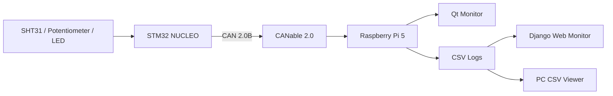

## 簡易構成図

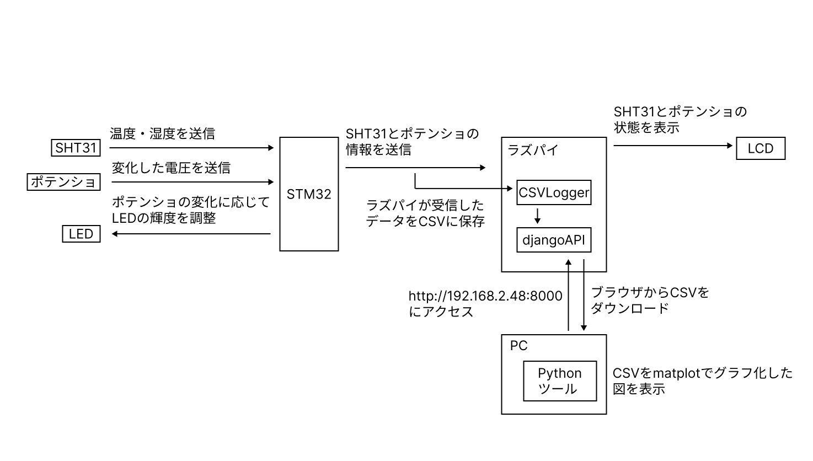

## 実機と機器構成

## システム構成図

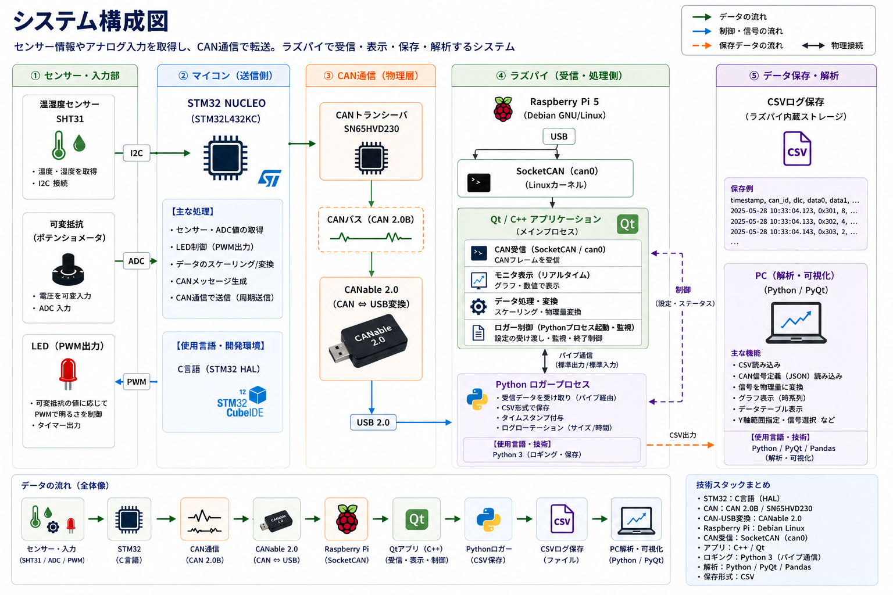

## データフロー図

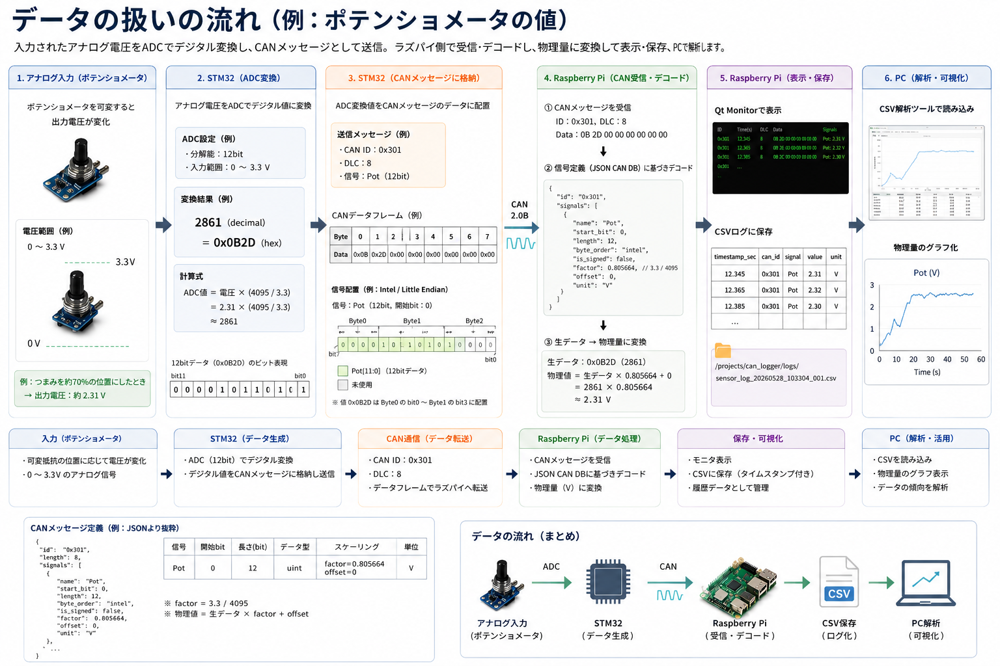

## シーケンス図

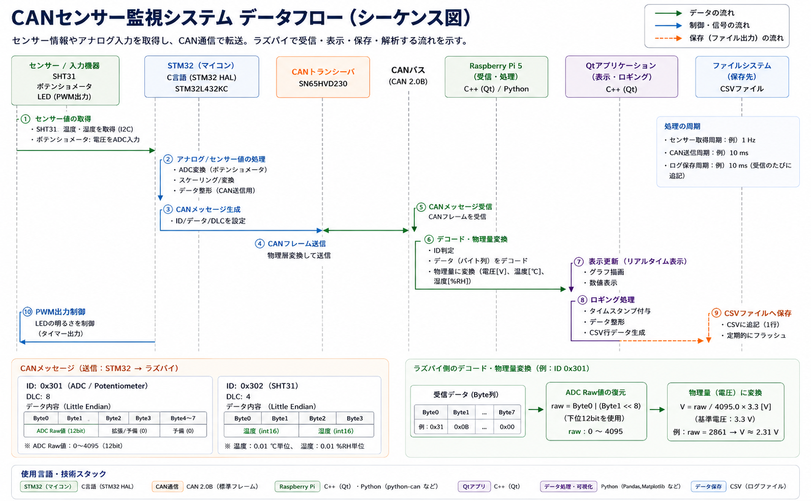

## Qt画面遷移図

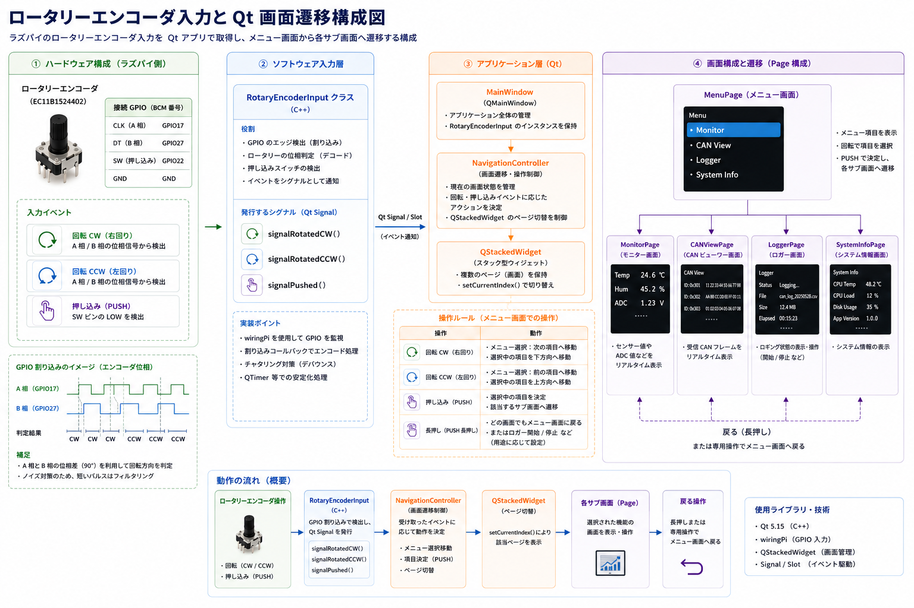

## 画面スクリーンショット

### System Menu

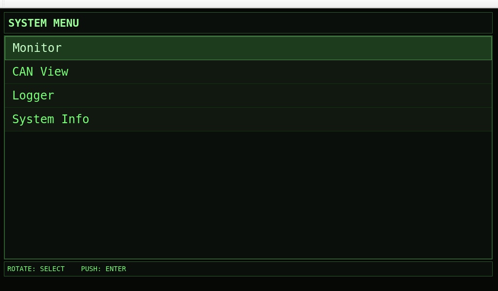

### Monitor

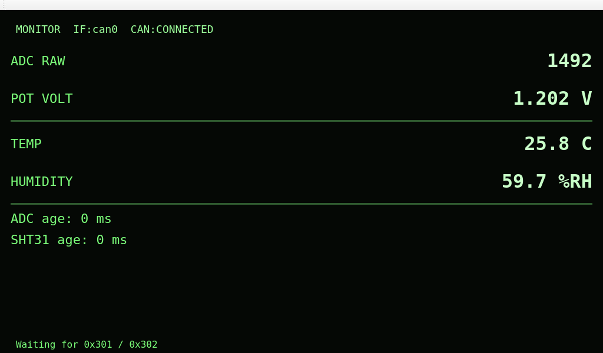

### CAN View

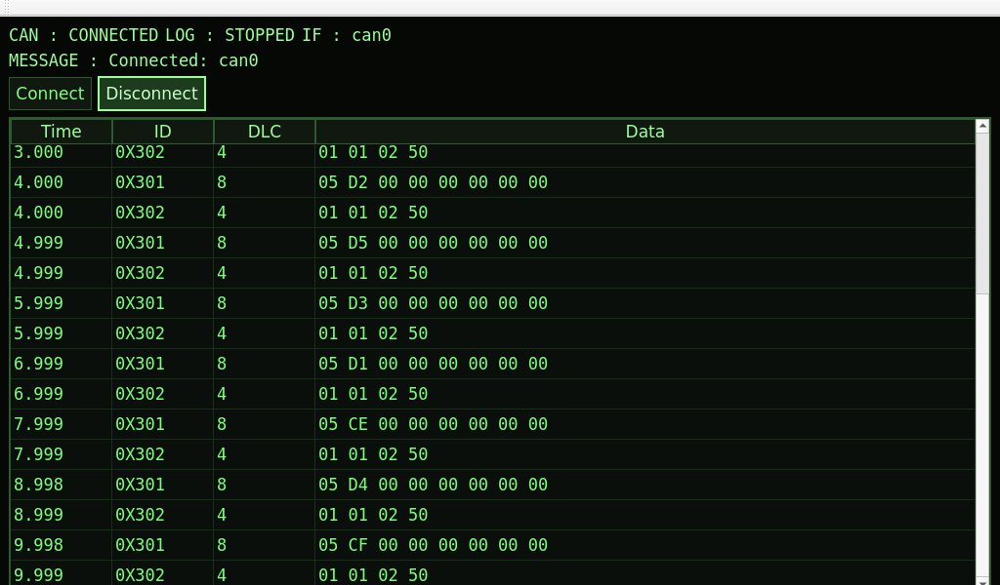

### Logger

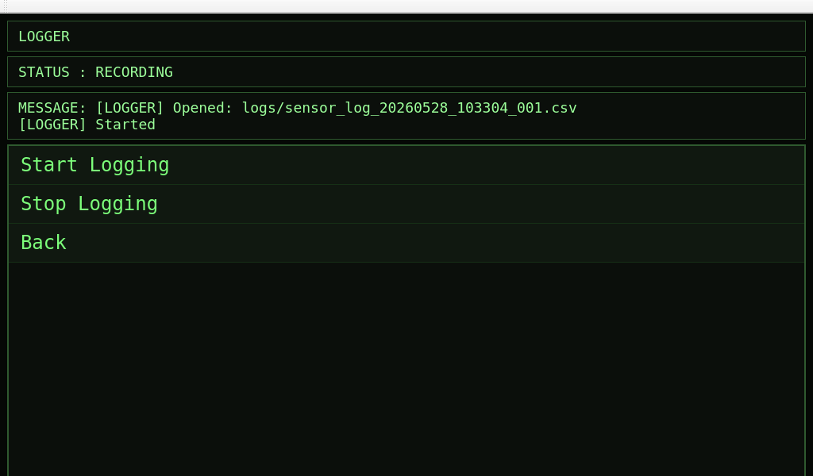

CSVログはRaspberry Pi上に保存され、Web MonitorやPCツールから参照できます。

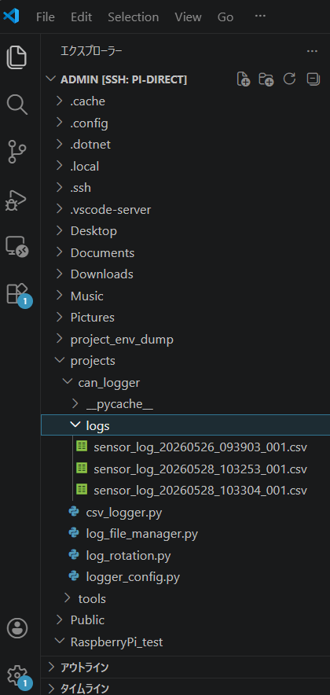

### System Info

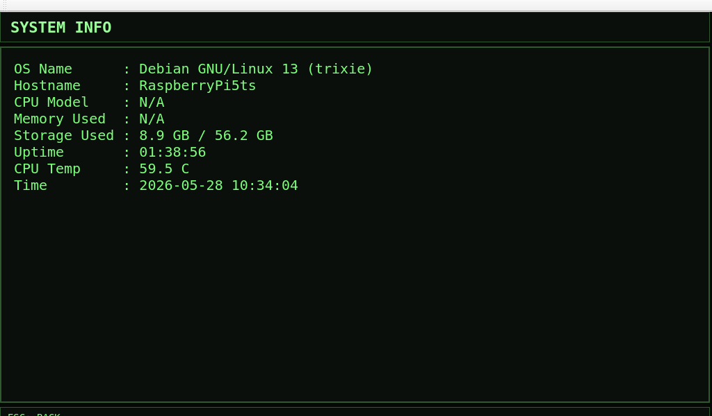

### PC CSV Viewer

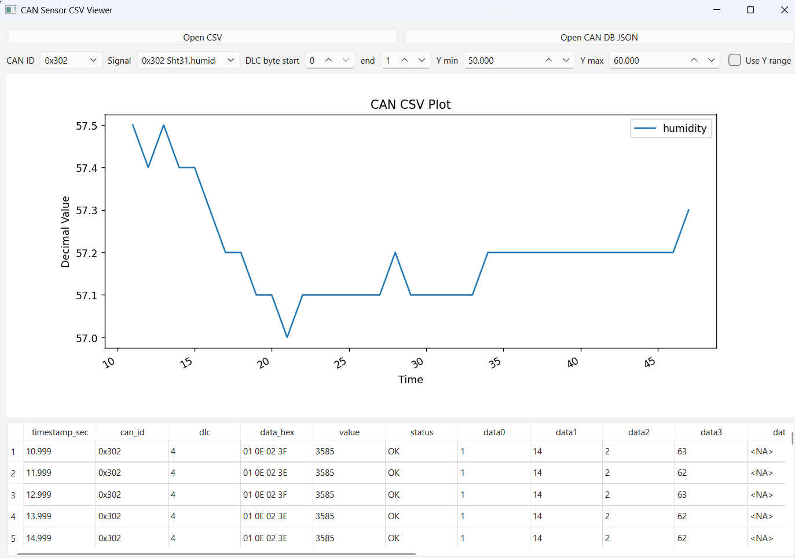

## Web監視システム構成図

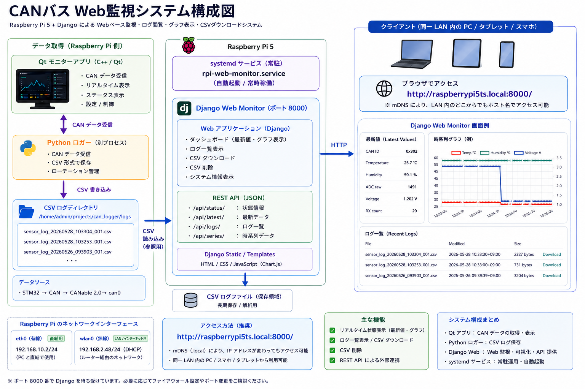

## Web監視 起動・プロセス構成図

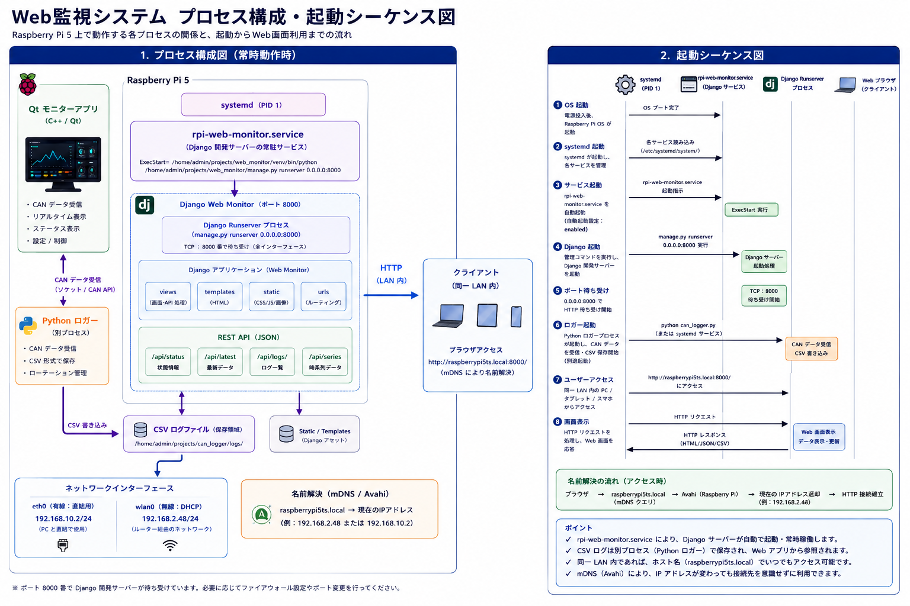

## 構成要素

| 要素 | 役割 |
| --- | --- |
| STM32 NUCLEO | センサー値、アナログ入力の取得、CANフレーム送信 |
| SHT31 | 温度・湿度センサー |
| Potentiometer | アナログ電圧入力 |
| SN65HVD230 | CANトランシーバ |
| CANable 2.0 | CANとUSBの変換、Raspberry PiのSocketCAN接続 |
| Raspberry Pi 5 | CAN受信、Qt表示、CSV保存、Web監視 |
| Qt Monitor | 実機LCDでのリアルタイム表示とローカル操作 |
| Django Web Monitor | LAN内ブラウザからの監視、ログ閲覧、REST API |
| PC CSV Viewer | CSVログのグラフ表示、CAN DB JSONによる信号デコード |

## 公開範囲

この公開版に含めるもの:

- システム概要
- 機器構成図
- データフロー図
- Qt画面遷移図
- Raspberry Pi Qt MonitorとPC Viewerの画面例
- Web監視構成図
- 起動・プロセス構成図

この公開版に含めないもの:

- STM32ファームウェアのソースコード
- Raspberry Pi上で動作するQt/Djangoアプリのソースコード
- PC解析ツールのソースコード
- 復元用の詳細手順
- 実運用ログ
- 秘密情報、認証情報、個別環境の設定値

## 備考

本リポジトリは概要説明用です。実装や復元情報を含む管理用リポジトリは別途privateで管理しています。
